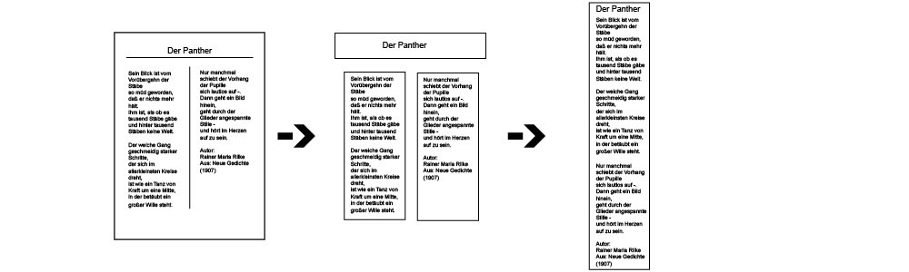

  
crop and splice segments  
========================  

Overview
--------

**crass** is a command line driven post-processing tool for scanned sheets of paper.
The main purpose is to crop segments based on separator lines and splice them afterwards
together in the reading order.

It is part of the [Aktienführer-Datenarchiv work process][akf-link],
but can also be used independently. 

Building instructions
---------------------

Dependencies can be installed into a Python Virtual Environment:

    $ virtualenv crass_venv/  
    $ source crass_venv/bin/activate  
    $ pip install -r requirements.txt  
    $ python setup.py install  

An alternative method using Conda is also possible:

    $ conda create -n crass_env python=2.7  
    $ source activate crass_env  
    $ conda install --file requirements.txt 
    $ python setup.py install  

The third alternative is to use the [Dockerfile](Dockerfile):

    $ docker build -t crass-app .
    $ docker run -it --rm -v "$PWD":/usr/src/app crass-app bash

Running
-------

Here is an example for a page:

    # perform deskewing, crop and splice of a page
    $ python ./crass.py "./test/testimg.jpg" "jpg" 
    
    # perform deskewing, crop and splice of a page 
    # the horziontal line is in the bottom area and is bound to the footer
    $ python ./crass.py "./test/testimg_bottom_skew.jpg" "jpg" --horlinepos 2 --horlinetype 1

The resulting files will be saved in the `out/` subdirectory (relative to the image file(s)) in several subsubdirectories.

Further Information
-------------------

You can find more information on the [basic concepts][basic-link] and the
[image processing][img-link] in the available documentation.

Copyright and License
----

Copyright (c) 2017 Universitätsbibliothek Mannheim

Author: [Jan Kamlah](https://github.com/jkamlah)

**crass** is Free Software. You may use it under the terms of the Apache 2.0 License.
See [LICENSE](./LICENSE) for details.

[akf-link]:  https://github.com/UB-Mannheim/Aktienfuehrer-Datenarchiv-Tools
[basic-link]: docs/basic-concepts.md
[img-link]: docs/image-processing.md
